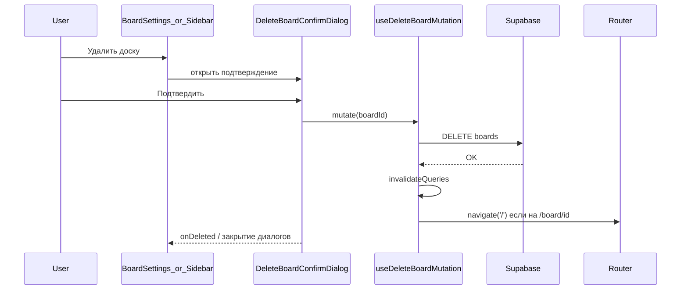

# Удаление доски: изменения и запросы

Документ фиксирует изменения, внесённые в рамках одной сессии работы с ассистентом, и **на основании каких запросов пользователя** они выполнялись.

---

## Запрос 1: «добавь кнопку удаления доски» (+ план)

**Запрос пользователя:** добавить возможность удалить доску из UI (изначально по согласованному плану: только владелец, подтверждение, инвалидация кэша, редирект со страницы доски).

**Сделано:**

1. **API** — [`src/features/boards/api/boards-api.ts`](../src/features/boards/api/boards-api.ts)  
   - Функция `deleteBoard(boardId: string)`: `supabase.from('boards').delete().eq('id', boardId)` с проверкой конфигурации и пробросом ошибки.

2. **TanStack Query** — [`src/features/boards/hooks/use-boards-queries.ts`](../src/features/boards/hooks/use-boards-queries.ts)  
   - Хук `useDeleteBoardMutation()`: после успеха инвалидирует запросы списка досок, детали доски и участников; при пути `/board/:boardId`, совпадающем с удалённой доской, вызывает `navigate('/')`.

3. **UI настроек доски** — [`src/features/boards/components/BoardSettingsDialog.tsx`](../src/features/boards/components/BoardSettingsDialog.tsx)  
   - Блок «Опасная зона» при `canManageMembers` (владелец).  
   - Диалог подтверждения удаления (необратимость, отмена / подтверждение).  
   - После успеха закрытие диалогов; индикатор загрузки и отображение ошибки.

4. **RLS (Supabase)**  
   - Проверено наличие политики `boards_delete_own` для `DELETE` с условием `auth.uid() = owner_id`. Отдельная миграция для этого шага не потребовалась.

*(Позже часть разметки подтверждения была вынесена в общий компонент — см. запрос 2.)*

---

## Запрос 2: «добавь также кнопку удаления на сайдбаре»

**Запрос пользователя:** кнопка удаления доски также в боковом списке досок.

**Сделано:**

1. **Общий диалог** — [`src/features/boards/components/DeleteBoardConfirmDialog.tsx`](../src/features/boards/components/DeleteBoardConfirmDialog.tsx)  
   - Переиспользуемое подтверждение удаления с `useDeleteBoardMutation`, колбэком `onDeleted?(boardId)` после успеха.

2. **Настройки доски** — [`src/features/boards/components/BoardSettingsDialog.tsx`](../src/features/boards/components/BoardSettingsDialog.tsx)  
   - Подтверждение удаления подключено через `DeleteBoardConfirmDialog`; по успеху вызывается `onOpenChange(false)` родительского диалога настроек.

3. **Сайдбар** — [`src/features/boards/components/BoardsSidebarList.tsx`](../src/features/boards/components/BoardsSidebarList.tsx)  
   - Для владельца (`showSettings`): рядом с кнопкой настроек — кнопка с иконкой корзины, открывающая тот же `DeleteBoardConfirmDialog`.  
   - После удаления сбрасывается открытое состояние настроек, если удалялась та же доска (`onDeleted`).

---

## Запрос 3: «напиши в файле документации все изменения…»

**Запрос пользователя:** задокументировать все перечисленные изменения и указать, **на основании каких запросов** они делались.

**Сделано:** этот файл.

---

## Краткая схема потока удаления

