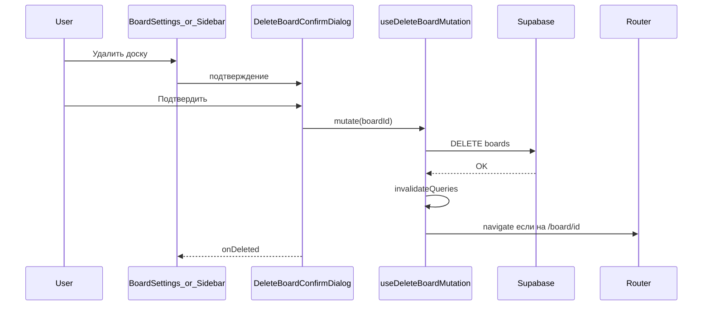
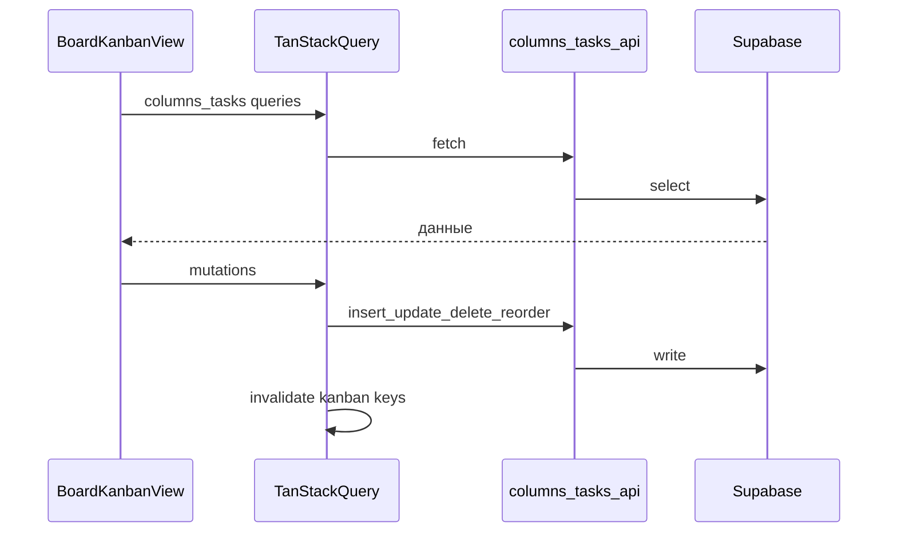
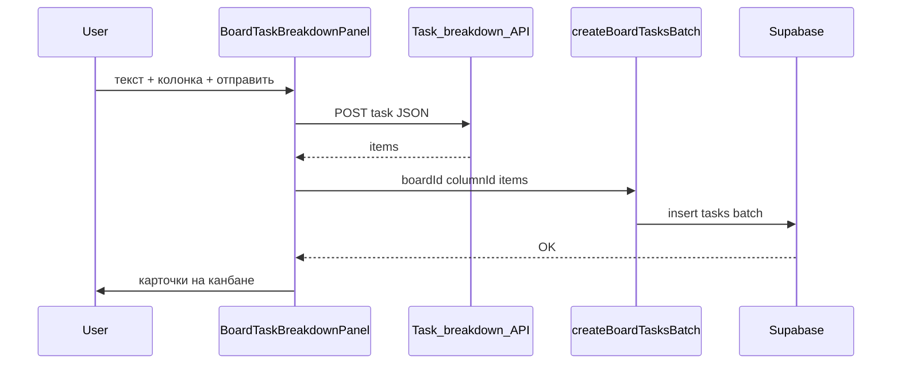

# Разработка вокруг доски: запросы и изменения

Кратко: **что запрашивалось** и **что сделано в коде** по доске и канбану.

---

## 1. Удаление доски

**Запросы:**

- Удалять доску из UI из настроек (владелец, подтверждение, инвалидация кэша, выход со страницы удалённой доски).
- Та же операция доступна из бокового списка досок.

**Сделано:** [`boards-api.ts`](../src/features/boards/api/boards-api.ts) — `deleteBoard`; [`use-boards-queries.ts`](../src/features/boards/hooks/use-boards-queries.ts) — `useDeleteBoardMutation`; [`BoardSettingsDialog`](../src/features/boards/components/BoardSettingsDialog.tsx), [`BoardsSidebarList`](../src/features/boards/components/BoardsSidebarList.tsx), общий [`DeleteBoardConfirmDialog`](../src/features/boards/components/DeleteBoardConfirmDialog.tsx). RLS: удаление доски для владельца.

---

## 2. Канбан: колонки и задачи в Supabase

**Запрос:** Подключить колонки и карточки к базе; формы карточки с реальными участниками доски; данные канбана через запросы, а не локальный стейт данных.

**Сделано:**

- Миграция [`supabase/migrations/20260205120000_board_columns_and_tasks.sql`](../supabase/migrations/20260205120000_board_columns_and_tasks.sql): таблицы `board_columns` и `tasks`, индексы, триггер `updated_at` для задач, RLS для владельца и участников `board_members`; у задач FK на колонку с `ON DELETE CASCADE`.
- [`src/types/database.ts`](../src/types/database.ts) — типы таблиц.
- [`src/features/columns/api/columns-api.ts`](../src/features/columns/api/columns-api.ts) — колонки; [`src/features/tasks/api/tasks-api.ts`](../src/features/tasks/api/tasks-api.ts) — задачи (DnD, удаление, батч-вставка для панели разбиения — раздел 3 ниже).
- [`src/features/boards/hooks/use-board-kanban-queries.ts`](../src/features/boards/hooks/use-board-kanban-queries.ts) — ключи канбана, запросы и мутации.
- [`TaskCardDialog`](../src/features/tasks/components/TaskCardDialog.tsx), [`ColumnEditorDialog`](../src/features/columns/components/ColumnEditorDialog.tsx), валидация [`task-create.ts`](../src/features/tasks/validations/task-create.ts).
- [`BoardPage`](../src/pages/board/BoardPage.tsx) загружает доску; канбан в [`BoardKanbanView`](../src/features/boards/components/BoardKanbanView.tsx).

---

## 3. Панель разбиения задач (внешний бэкенд → Supabase)

**Запрос:** Окно на доске: отправка текста задачи на бэкенд, ответ с массивом подзадач, массовое создание карточек в выбранной колонке.

**Сделано:**

- Переменная окружения **`VITE_TASK_BREAKDOWN_API_URL`** — полный URL эндпоинта (см. [`.env.example`](../.env.example)). Тело запроса: `POST` JSON `{"task": "<текст>"}`. Ответ: `{ "items": [ { "title", "description", "color" }, ... ] }` (проверка через Zod).
- [`src/features/ai/api/task-breakdown.ts`](../src/features/ai/api/task-breakdown.ts) — `requestTaskBreakdown`, `getTaskBreakdownApiUrl`.
- Цвет из API часто приходит как hex (`#3b82f6`); в БД и UI карточки используются только Tailwind-пресеты колонок/карточек. Сопоставление: [`src/features/tasks/utils/api-color-to-preset.ts`](../src/features/tasks/utils/api-color-to-preset.ts) (`apiColorToColumnPreset`).
- Пакетная вставка: [`createBoardTasksBatch`](../src/features/tasks/api/tasks-api.ts) — один `insert` нескольких строк с корректными `position`; хук [`useCreateBoardTasksBatchMutation`](../src/features/boards/hooks/use-board-kanban-queries.ts).
- UI: [`BoardTaskBreakdownPanel`](../src/features/ai/components/BoardTaskBreakdownPanel.tsx) (fixed, сворачивание), подключён в [`BoardKanbanView`](../src/features/boards/components/BoardKanbanView.tsx). i18n: ключи `board.taskBreakdown*` и `errors.taskBreakdown*` / `errors.createTasksBatchFailed`.

**Заметки:** На стороне бэкенда нужен **CORS** для origin фронта. Без `VITE_TASK_BREAKDOWN_API_URL` кнопка отправки недоступна (подсказка в панели).

---

## 4. Drag-and-drop карточек между колонками

**Запрос:** Перетаскивание карточек между колонками и сохранение порядка.

**Сделано:** `@dnd-kit` в [`BoardKanbanView.tsx`](../src/features/boards/components/BoardKanbanView.tsx): несколько `SortableContext`, `DragOverlay`, зона дропа для пустой колонки. В [`tasks-api.ts`](../src/features/tasks/api/tasks-api.ts) — `syncColumnTaskOrder`, `applyKanbanTaskMoves`; в [`use-board-kanban-queries.ts`](../src/features/boards/hooks/use-board-kanban-queries.ts) — `useReorderKanbanTasksMutation`.

---

## 5. Удаление колонок и карточек

**Запрос:** Возможность удалять колонки и карточки канбана.

**Сделано:** `deleteBoardColumn` и `deleteBoardTask` в API; `useDeleteBoardColumnMutation`, `useDeleteBoardTaskMutation`. Меню колонки (⋯): редактировать / удалить; [`ColumnDeleteConfirmDialog`](../src/features/columns/components/ColumnDeleteConfirmDialog.tsx). Редактирование карточки: удаление через подтверждение во втором диалоге в [`TaskCardDialog`](../src/features/tasks/components/TaskCardDialog.tsx). При удалении колонки закрывается диалог карточки, если она была открыта для задачи из этой колонки. Отдельная миграция не нужна — политики `DELETE` в RLS уже были.

---

## Схема: удаление доски

---

## Схема: канбан — загрузка и запись

---

## Схема: разбиение задачи и батч в колонку

