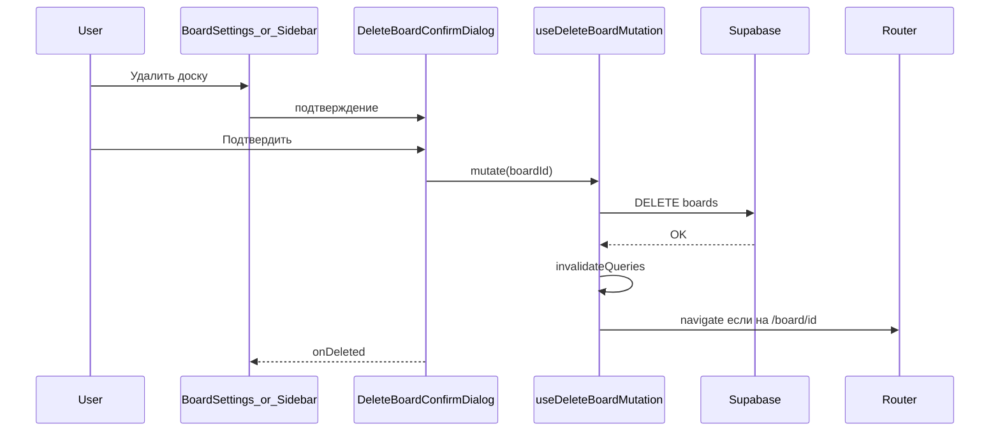
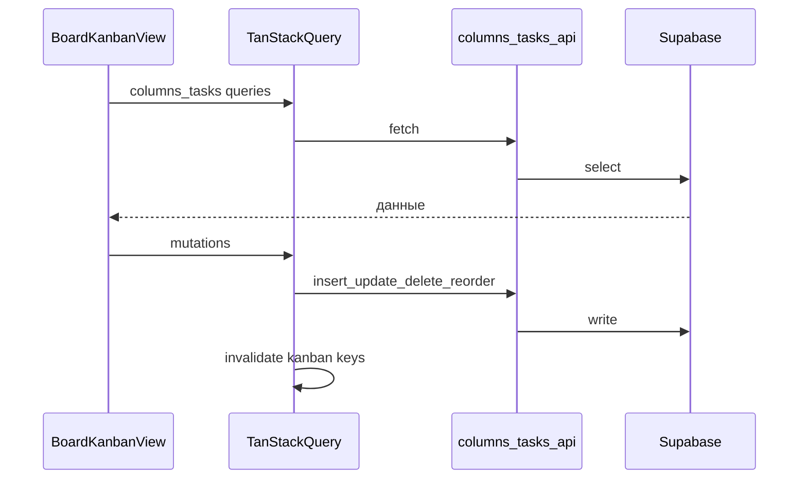
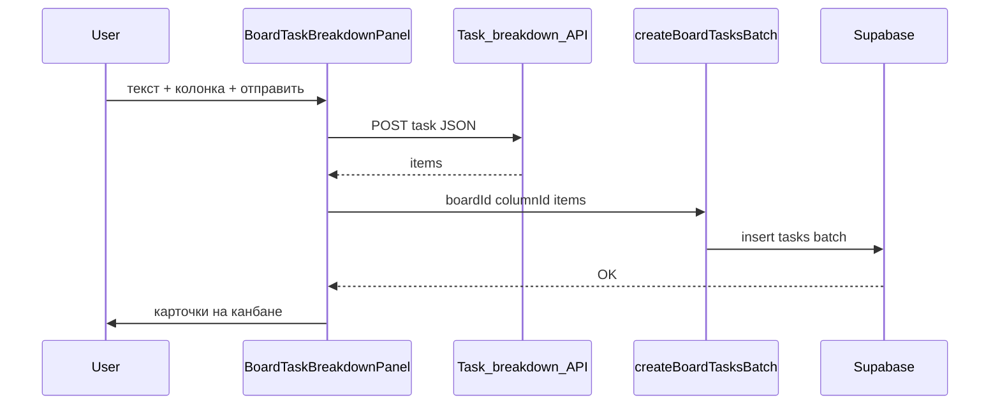
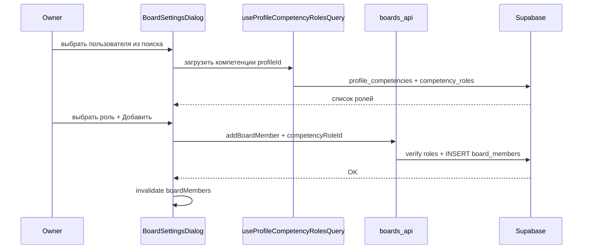

# Разработка вокруг доски: запросы и изменения

Кратко: **что запрашивалось** и **что сделано в коде** по доске и канбану.

## Миграции Supabase (порядок применения)

Для пустого проекта файлы из [`supabase/migrations/`](../supabase/migrations/) выполняются по префиксу даты:

1. [`20260105120000_profiles_boards_core.sql`](../supabase/migrations/20260105120000_profiles_boards_core.sql) — `profiles`, `boards`, `board_members`, RLS, триггер `updated_at` для досок.
2. [`20260205120000_board_columns_and_tasks.sql`](../supabase/migrations/20260205120000_board_columns_and_tasks.sql) — `board_columns`, `tasks` и RLS (нужны существующие `boards` и `profiles`).
3. [`20260509120000_competencies.sql`](../supabase/migrations/20260509120000_competencies.sql) — `competency_roles`, `profile_competencies`, ограничения (одна основная роль, до 5 на профиль), RLS, сиды справочника.
4. [`20260510120000_board_member_competency_role.sql`](../supabase/migrations/20260510120000_board_member_competency_role.sql) — `board_members.competency_role_id` → `competency_roles`, бэктфилл, `NOT NULL`.
5. [`20260510121500_profile_competencies_public_read.sql`](../supabase/migrations/20260510121500_profile_competencies_public_read.sql) — политика `SELECT` для всех `authenticated` на `profile_competencies`, чтобы владелец доски мог видеть компетенции приглашаемого пользователя.
6. [`20260511120000_board_owner_member_backfill.sql`](../supabase/migrations/20260511120000_board_owner_member_backfill.sql) — бэктфилл владельца в `board_members` (если ещё нет строки).
7. [`20260512120000_board_members_insert_owner_check.sql`](../supabase/migrations/20260512120000_board_members_insert_owner_check.sql) — исправление RLS для `INSERT` в `board_members` (функция `is_board_owner`).

---

## 1. Удаление доски

**Запросы:**

- Удалять доску из UI из настроек (владелец, подтверждение, инвалидация кэша, выход со страницы удалённой доски).
- Та же операция доступна из бокового списка досок.

**Сделано:** [`boards-api.ts`](../src/features/boards/api/boards-api.ts) — `deleteBoard`; [`use-boards-queries.ts`](../src/features/boards/hooks/use-boards-queries.ts) — `useDeleteBoardMutation`; [`BoardSettingsDialog`](../src/features/boards/components/BoardSettingsDialog.tsx), [`BoardsSidebarList`](../src/features/boards/components/BoardsSidebarList.tsx), общий [`DeleteBoardConfirmDialog`](../src/features/boards/components/DeleteBoardConfirmDialog.tsx). RLS: удаление доски для владельца.

---

## 2. Канбан: колонки и задачи в Supabase

**Запрос:** Подключить колонки и карточки к базе; формы карточки с реальными участниками доски; данные канбана через запросы, а не локальный стейт данных.

**Сделано:**

- Базовые таблицы доступа к доскам — см. миграцию `20260105120000_profiles_boards_core.sql` (`profiles`, `boards`, `board_members`).
- Миграция [`supabase/migrations/20260205120000_board_columns_and_tasks.sql`](../supabase/migrations/20260205120000_board_columns_and_tasks.sql): таблицы `board_columns` и `tasks`, индексы, триггер `updated_at` для задач, RLS для владельца и участников `board_members`; у задач FK на колонку с `ON DELETE CASCADE`.
- [`src/types/database.ts`](../src/types/database.ts) — типы таблиц.
- [`src/features/columns/api/columns-api.ts`](../src/features/columns/api/columns-api.ts) — колонки; [`src/features/tasks/api/tasks-api.ts`](../src/features/tasks/api/tasks-api.ts) — задачи (DnD, удаление, батч-вставка для панели разбиения — раздел 3 ниже).
- [`src/features/boards/hooks/use-board-kanban-queries.ts`](../src/features/boards/hooks/use-board-kanban-queries.ts) — ключи канбана, запросы и мутации.
- [`TaskCardDialog`](../src/features/tasks/components/TaskCardDialog.tsx), [`ColumnEditorDialog`](../src/features/columns/components/ColumnEditorDialog.tsx), валидация [`task-create.ts`](../src/features/tasks/validations/task-create.ts).
- [`BoardPage`](../src/pages/board/BoardPage.tsx) загружает доску; канбан в [`BoardKanbanView`](../src/features/boards/components/BoardKanbanView.tsx).

Список участников для карточек и заголовка канбана строится из [`fetchBoardMembers`](../src/features/boards/api/boards-api.ts); у участников из `board_members` к подписи добавляется роль на доске (`competency_roles.slug` через i18n `competencies.roles.*`) — см. раздел 7.

---

## 3. Панель разбиения задач (внешний бэкенд → Supabase)

**Запрос:** Окно на доске: отправка текста задачи на бэкенд, ответ с массивом подзадач, массовое создание карточек в выбранной колонке.

**Сделано:**

- Переменная окружения **`VITE_OPENROUTER_API_URL`** — полный URL эндпоинта (Worker/OpenRouter), см. [`.env.example`](../.env.example). Тело запроса: `POST` JSON `{"prompt": "<текст>"}`. Ответ: `{ "items": [ { "title", "description", "color" }, ... ] }` (проверка через Zod).
- [`src/features/ai/api/task-breakdown.ts`](../src/features/ai/api/task-breakdown.ts) — `requestTaskBreakdown`, `getTaskBreakdownApiUrl`.
- Цвет из API часто приходит как hex (`#3b82f6`); в БД и UI карточки используются только Tailwind-пресеты колонок/карточек. Сопоставление: [`src/features/tasks/utils/api-color-to-preset.ts`](../src/features/tasks/utils/api-color-to-preset.ts) (`apiColorToColumnPreset`).
- Пакетная вставка: [`createBoardTasksBatch`](../src/features/tasks/api/tasks-api.ts) — один `insert` нескольких строк с корректными `position`; хук [`useCreateBoardTasksBatchMutation`](../src/features/boards/hooks/use-board-kanban-queries.ts).
- UI: [`BoardTaskBreakdownPanel`](../src/features/ai/components/BoardTaskBreakdownPanel.tsx) (fixed, сворачивание), подключён в [`BoardKanbanView`](../src/features/boards/components/BoardKanbanView.tsx). i18n: ключи `board.taskBreakdown*` и `errors.taskBreakdown*` / `errors.createTasksBatchFailed`.

**Заметки:** На стороне бэкенда нужен **CORS** для origin фронта. Без `VITE_OPENROUTER_API_URL` кнопка отправки недоступна (подсказка в панели).

---

## 4. Drag-and-drop карточек между колонками

**Запрос:** Перетаскивание карточек между колонками и сохранение порядка.

**Сделано:** `@dnd-kit` в [`BoardKanbanView.tsx`](../src/features/boards/components/BoardKanbanView.tsx): несколько `SortableContext`, `DragOverlay`, зона дропа для пустой колонки. В [`tasks-api.ts`](../src/features/tasks/api/tasks-api.ts) — `syncColumnTaskOrder`, `applyKanbanTaskMoves`; в [`use-board-kanban-queries.ts`](../src/features/boards/hooks/use-board-kanban-queries.ts) — `useReorderKanbanTasksMutation`.

---

## 5. Удаление колонок и карточек

**Запрос:** Возможность удалять колонки и карточки канбана.

**Сделано:** `deleteBoardColumn` и `deleteBoardTask` в API; `useDeleteBoardColumnMutation`, `useDeleteBoardTaskMutation`. Меню колонки (⋯): редактировать / удалить; [`ColumnDeleteConfirmDialog`](../src/features/columns/components/ColumnDeleteConfirmDialog.tsx). Редактирование карточки: удаление через подтверждение во втором диалоге в [`TaskCardDialog`](../src/features/tasks/components/TaskCardDialog.tsx). При удалении колонки закрывается диалог карточки, если она была открыта для задачи из этой колонки. Отдельная миграция не нужна — политики `DELETE` в RLS уже были.

---

## 6. Компетенции пользователя (профиль, onboarding, настройки)

**Сделано:**

- Таблицы и RLS — миграция `20260509120000_competencies.sql`.
- API и формы: [`src/features/competencies/`](../src/features/competencies/) — `fetchCompetencyCatalog`, `fetchMyCompetencies`, `replaceMyCompetencies`, `fetchProfileCompetencyRoles` ([`competencies-api.ts`](../src/features/competencies/api/competencies-api.ts)), хуки в [`use-competencies-queries.ts`](../src/features/competencies/hooks/use-competencies-queries.ts), UI [`CompetenciesEditor`](../src/features/competencies/components/CompetenciesEditor.tsx).
- Обязательная основная роль и до пяти ролей из справочника; названия ролей в i18n: `competencies.roles.<slug>`.
- Маршрут после входа: [`router.tsx`](../src/app/router.tsx) — `CompetenciesCompleteGate` у основного layout; без основной роли в профиле — редирект на `/onboarding/competencies` ([`CompetenciesOnboardingPage`](../src/pages/onboarding/CompetenciesOnboardingPage.tsx)). Редактирование компетенций также в [`SettingsPage`](../src/pages/settings/SettingsPage.tsx).

---

## 7. Роль участника на конкретной доске

**Сделано:**

- Колонка **`board_members.competency_role_id`** (FK на `competency_roles`), бэктфилл для старых строк — миграция `20260510120000_board_member_competency_role.sql`.
- Чтение компетенций другого пользователя при приглашении: политика в `20260510121500_profile_competencies_public_read.sql`.
- [`fetchBoardMembers`](../src/features/boards/api/boards-api.ts) возвращает `competency_role_id` и вложенный `competency_roles(slug)`; тип [`BoardMemberWithProfile`](../src/features/boards/api/boards-api.ts).
- [`addBoardMember(boardId, userId, competencyRoleId)`](../src/features/boards/api/boards-api.ts) проверяет через `fetchProfileCompetencyRoles`, что выбранная роль есть у приглашаемого; ошибки `errors.boardMemberNoCompetencies`, `errors.boardMemberRoleInvalid`.
- UI: [`BoardSettingsDialog`](../src/features/boards/components/BoardSettingsDialog.tsx) — после выбора пользователя из поиска шаг с радио-списком его компетенций, кнопки «Назад к поиску» / «Добавить на доску»; в списке участников строка `boardSettings.memberBoardRole`. Мутация [`useAddBoardMemberMutation`](../src/features/boards/hooks/use-boards-queries.ts) принимает `{ userId, competencyRoleId }`.
- Канбан: в [`BoardKanbanView`](../src/features/boards/components/BoardKanbanView.tsx) для участников (не для владельца из отдельного профиля) к подписи добавляется локализованная роль (`имя · роль`) в `assigneeOptions`, `assigneePreviewById`, `headerMembers`.

---

## Схема: удаление доски

---

## Схема: канбан — загрузка и запись

---

## Схема: разбиение задачи и батч в колонку

---

## Схема: приглашение участника с ролью на доске

