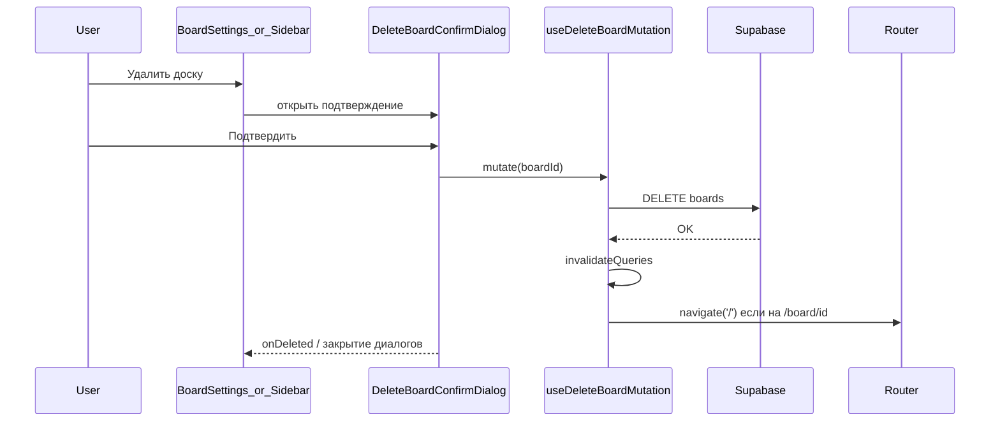
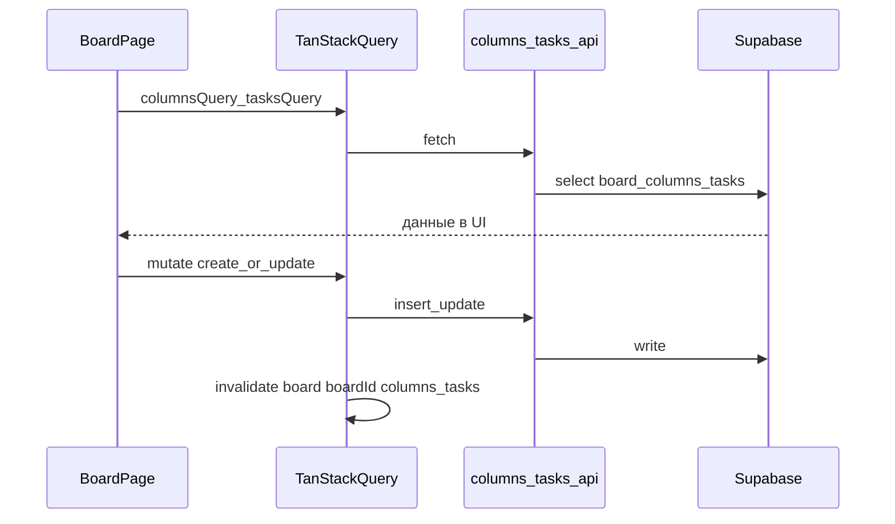

# Разработка вокруг доски: запросы и изменения

Документ фиксирует изменения по фичам доски (удаление, канбан, Supabase) и **на основании каких запросов пользователя** они выполнялись.  
Ранее файл назывался `board-delete-feature.md`; переименован в `board_develop.md`, чтобы объединить темы развития доски.

---

## Запрос 1: «добавь кнопку удаления доски» (+ план)

**Запрос пользователя:** добавить возможность удалить доску из UI (изначально по согласованному плану: только владелец, подтверждение, инвалидация кэша, редирект со страницы доски).

**Сделано:**

1. **API** — [`src/features/boards/api/boards-api.ts`](../src/features/boards/api/boards-api.ts)  
   - Функция `deleteBoard(boardId: string)`: `supabase.from('boards').delete().eq('id', boardId)` с проверкой конфигурации и пробросом ошибки.

2. **TanStack Query** — [`src/features/boards/hooks/use-boards-queries.ts`](../src/features/boards/hooks/use-boards-queries.ts)  
   - Хук `useDeleteBoardMutation()`: после успеха инвалидирует запросы списка досок, детали доски и участников; при пути `/board/:boardId`, совпадающем с удалённой доской, вызывает `navigate('/')`.

3. **UI настроек доски** — [`src/features/boards/components/BoardSettingsDialog.tsx`](../src/features/boards/components/BoardSettingsDialog.tsx)  
   - Блок «Опасная зона» при `canManageMembers` (владелец).  
   - Диалог подтверждения удаления (необратимость, отмена / подтверждение).  
   - После успеха закрытие диалогов; индикатор загрузки и отображение ошибки.

4. **RLS (Supabase)**  
   - Проверено наличие политики `boards_delete_own` для `DELETE` с условием `auth.uid() = owner_id`. Отдельная миграция для этого шага не потребовалась.

*(Позже часть разметки подтверждения была вынесена в общий компонент — см. запрос 2.)*

---

## Запрос 2: «добавь также кнопку удаления на сайдбаре»

**Запрос пользователя:** кнопка удаления доски также в боковом списке досок.

**Сделано:**

1. **Общий диалог** — [`src/features/boards/components/DeleteBoardConfirmDialog.tsx`](../src/features/boards/components/DeleteBoardConfirmDialog.tsx)  
   - Переиспользуемое подтверждение удаления с `useDeleteBoardMutation`, колбэком `onDeleted?(boardId)` после успеха.

2. **Настройки доски** — [`src/features/boards/components/BoardSettingsDialog.tsx`](../src/features/boards/components/BoardSettingsDialog.tsx)  
   - Подтверждение удаления подключено через `DeleteBoardConfirmDialog`; по успеху вызывается `onOpenChange(false)` родительского диалога настроек.

3. **Сайдбар** — [`src/features/boards/components/BoardsSidebarList.tsx`](../src/features/boards/components/BoardsSidebarList.tsx)  
   - Для владельца (`showSettings`): рядом с кнопкой настроек — кнопка с иконкой корзины, открывающая тот же `DeleteBoardConfirmDialog`.  
   - После удаления сбрасывается открытое состояние настроек, если удалялась та же доска (`onDeleted`).

---

## Запрос 3: «напиши в файле документации все изменения…»

**Запрос пользователя:** задокументировать все перечисленные изменения и указать, **на основании каких запросов** они делались.

**Сделано:** документ с запросами 1–2; позже расширен (этот файл).

---

## Запрос 4: «Подключение колонок и карточек к Supabase» / «Implement the plan» (план Kanban + Supabase)

**Запрос пользователя:** подключить колонки и карточки канбана к базе; реализовать план «Подключение колонок и карточек к Supabase» (миграция, типы, API, TanStack Query, форма карточки с реальными участниками, `BoardPage` без локального стейта данных).

**Сделано:**

1. **Миграция SQL** — [`supabase/migrations/20260205120000_board_columns_and_tasks.sql`](../supabase/migrations/20260205120000_board_columns_and_tasks.sql)  
   - Таблицы `board_columns` и `tasks` (FK на `boards`, `board_columns`, `profiles`), индексы, триггер обновления `updated_at` для `tasks`, **RLS**: доступ при `owner_id = auth.uid()` или записи в `board_members`.  
   - Миграция применена к проекту Supabase через MCP (`apply_migration`).

2. **Типы клиента** — [`src/types/database.ts`](../src/types/database.ts)  
   - Описаны таблицы `board_columns` и `tasks` и связи `Relationships`.

3. **API**  
   - [`src/features/columns/api/columns-api.ts`](../src/features/columns/api/columns-api.ts): `fetchBoardColumns`, `createBoardColumn` (вычисление `position`), `updateBoardColumn`, нормализация цвета пресетов.  
   - [`src/features/tasks/api/tasks-api.ts`](../src/features/tasks/api/tasks-api.ts): `fetchBoardTasks`, `createBoardTask`, `updateBoardTask`, нормализация цвета.

4. **TanStack Query** — [`src/features/boards/hooks/use-board-kanban-queries.ts`](../src/features/boards/hooks/use-board-kanban-queries.ts)  
   - Ключи `['board', boardId, 'columns'|'tasks']`, хуки запросов и мутаций с инвалидацией канбана.

5. **Формы и диалоги**  
   - [`src/features/tasks/validations/task-create.ts`](../src/features/tasks/validations/task-create.ts): `createTaskFormSchema(allowedAssigneeIds)` — ответственный только из списка UUID участников.  
   - [`src/features/tasks/components/TaskCardDialog.tsx`](../src/features/tasks/components/TaskCardDialog.tsx): проп `assigneeOptions`, async-сабмит после успеха мутации.  
   - [`src/features/columns/components/ColumnEditorDialog.tsx`](../src/features/columns/components/ColumnEditorDialog.tsx): async `onSubmit`, тексты про сохранение в Supabase.

6. **Страница доски** — [`src/pages/board/BoardPage.tsx`](../src/pages/board/BoardPage.tsx)  
   - Данные колонок и задач из запросов; мутации вместо `useState` для канбана; шапка с владельцем и участниками; отображение ответственного по профилям; загрузка и ошибки в области канбана; баннер ошибок сохранения.

7. **Прочее**  
   - Удалён неиспользуемый [`src/features/tasks/constants/mock-assignees.ts`](../src/features/tasks/constants/mock-assignees.ts) (моки ответственных заменены данными доски).  
   - Сборка и точечный ESLint по затронутым файлам проверены.

---

## Запрос 5: «добавь в файл документации мои запросы… Переименуй файл на board_develop»

**Запрос пользователя:** дополнить документацию запросами и итогами **этого диалога** и переименовать файл в `board_develop`.

**Сделано:** добавлены запросы 4–5 и сводка по канбану + Supabase; файл сохранён как [`docs/board_develop.md`](board_develop.md), прежний `board-delete-feature.md` удалён.

---

## Краткая схема потока удаления доски

---

## Краткая схема загрузки и сохранения канбана

